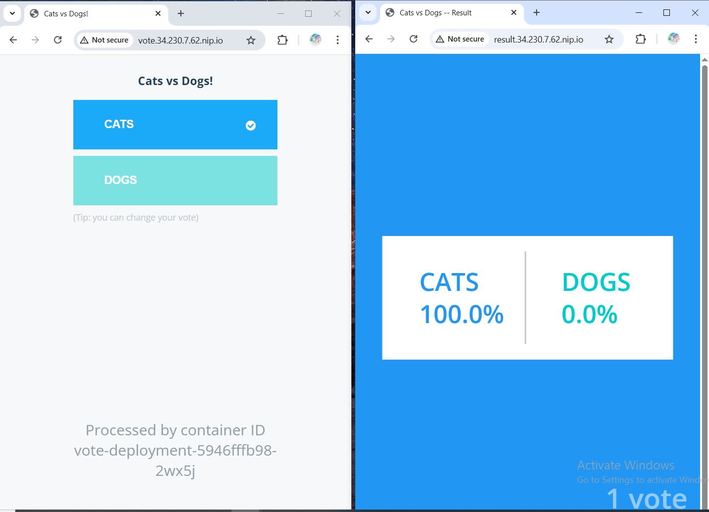
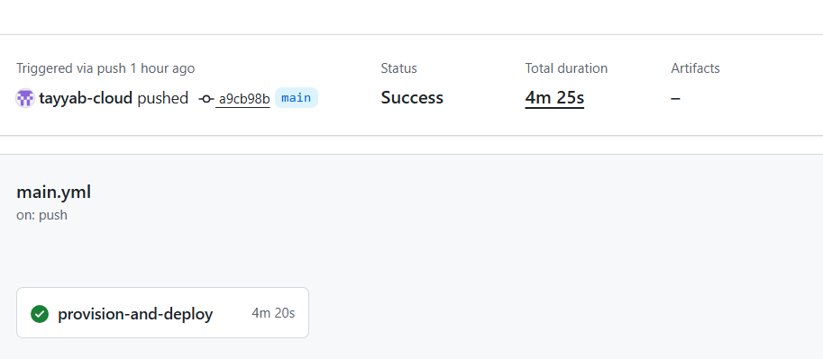
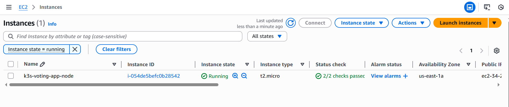
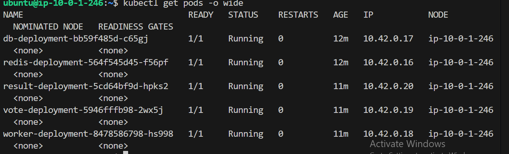

# 🚀 Automated K3s Kubernetes Cluster on AWS Free Tier (CI/CD)


## 📋 Project Overview
This project demonstrates a fully automated **DevOps CI/CD pipeline** that provisions infrastructure on **AWS**, configures a lightweight **Kubernetes (K3s)** cluster, and deploys a Microservices-based **Voting Application**.

The entire workflow is triggered by a simple `git push`, utilizing **Terraform** for Infrastructure as Code (IaC), **Ansible** for Configuration Management, and **GitHub Actions** for orchestration.

### 🎯 Key Engineering Challenge
Running a full microservices stack (Python, Node.js, .NET, Redis, Postgres) on a **t2.micro (1GB RAM)** instance is resource-intensive.
**Solution:** I implemented an automated **Swap Memory (2GB)** configuration via Ansible to prevent OOM (Out of Memory) kills, ensuring stability within the AWS Free Tier limits.

---
## 🏗️ Architecture Flow


## 📦 Tech Stack

| Category | Tools Used |
|----------|-----------|
| Cloud Provider | AWS (EC2, VPC, S3, DynamoDB) |
| Infrastructure as Code | Terraform (Remote State Management) |
| Configuration Management | Ansible (Dynamic Inventory) |
| Orchestration | K3s (Lightweight Kubernetes) |
| CI/CD | GitHub Actions |
| App Stack | Python, Node.js, .NET Core, Redis, PostgreSQL |
| Ingress Controller | Traefik |


## 📸 Project Screenshots

1. **The Voting App & Results (Live Deployment)**



2. **Infrastructure Automation (GitHub Actions)**



3. **The EC2 Instance (Running State)**



4. **The Kubernetes Cluster (Engine Room)**



## 🚀 How to Deploy

### Prerequisites
- AWS Account (Free Tier eligible).
- S3 Bucket & DynamoDB Table created manually for Terraform Backend (State locking).

### Step 1: Configure GitHub Secrets

Go to Settings → Secrets and variables → Actions and add:
- **AWS_ACCESS_KEY_ID**: Your AWS Access Key.
- **AWS_SECRET_ACCESS_KEY**: Your AWS Secret Key.
- **SSH_PRIVATE_KEY**: The private key content (generated via `ssh-keygen`).
- **SSH_PUBLIC_KEY**: The public key content.

### Step 2: Trigger the Pipeline

Simply push to the main branch:

```bash
git add .
git commit -m "Deploying K3s Cluster"
git push origin main
```

### Step 3: Access the Application

Once the pipeline finishes, the Ingress Controller will assign a public IP. Access the apps via:
- **Vote App**: `http://vote.<EC2-PUBLIC-IP>.nip.io`
- **Result App**: `http://result.<EC2-PUBLIC-IP>.nip.io`

## 📁 Directory Structure

```
├── .github/workflows   # GitHub Actions Pipeline (CI/CD)
├── ansible/            # Ansible Playbooks (K3s install, Swap config)
├── k8s-manifests/      # Kubernetes YAML files (Deployments, Services, Ingress)
├── terraform/          # Terraform Infrastructure Code (main.tf, variables.tf)
└── README.md           # Project Documentation
```

## 🔮 Future Improvements

- **Monitoring**: Integrate Prometheus & Grafana for cluster metrics.
- **DNS**: Automate real domain mapping instead of nip.io.
- **Security**: Implement HTTPS via Cert-Manager and Let's Encrypt.

## 👤 Author

M Tayyab https://github.com/tayyab-cloud  
DevOps Engineer
